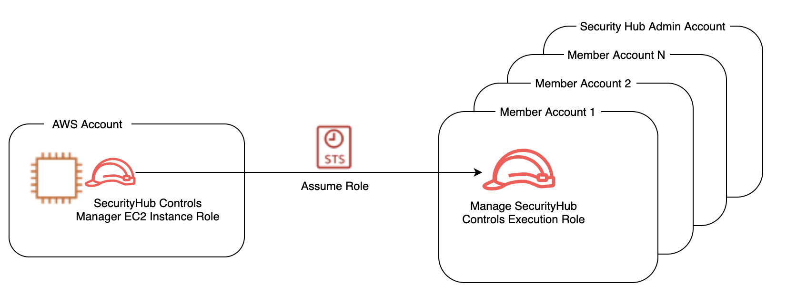

# AWS-SecurityHub
# Introduction
Here in this repo, I would like to share my experience regarding implementing the CIS benchmark on AWS. I have explored great repositories that offer different remediation approaches that I will introduce here.  However, we need to have a clear understanding of our company policy and conditions to help us to decide to accept the specific approach or sometimes customization. There are some pros and cons related to these approaches which I try to review here and you are welcome to contribute here.

## Table of contents

- [What's included](#whats-included)
- [Phase zero](#Phase-zero)


## What's included
```
├── ./SecurityHub-Multiaccount-UpdateControls
```

## Phase zero
Before starting failed control remediation there is a task, we need to take care of that. There is a fact that there are lots of redundant or unnecessary controls in the security hub console which required cleaning up to provide clean and meaningful findings. There is a pretty good AWS security blog for “[Disabling Security Hub controls in a multi-account environment](https://aws.amazon.com/blogs/security/disabling-security-hub-controls-in-a-multi-account-environment/)” that most of the content of this part and related code is coming from this post. Therefore, I just provide a brief introduction to the solution and I just add my experience and modification here.

There are many reasons behind this issue (redundant or unnecessary controls):
- Controls that audit global resources
- Controls with accepted risk
- Controls that audit unused services

### Controls that audit global resources:
Due to a regional audit by the security hub for global resources, redundant audits execute which generate redundant false negative or positive while AWS charge us for those audits. Therefore, we can disable security hub control for global resources such as Identity and Access Management (IAM) in all regions except the region in which global resources are enabled in AWS Config.

### Controls with accepted risk:
Based on the organization's situation and policy, there might be a risk that is accepted. So it is required to be disabled the specific control.

### Controls that audit unused services:
If there is control related to a specific service that is not used in your organization or account, it is required to be disabled to save daily costs and clean your findings.

The former post which I shared is introducing a cross-account solution to disable controls in organizations. 

### Solution:
In this solution, an execution role creates in all member accounts and security hub manager accounts to assume by a SecurityHub Controls Manager role to call required APIs to disable or enable security controls.




- The details implementation already exists in the README file. There is a modification to the code compared to the original one:
I have added a feature to define the exception region. The reason behind that is when we want to disable the redundant controls, we want to keep control enabled in one region. So we can select all regions to be disabled except one region where AWS config global resource is enabled which makes life much easier.
- I have added the Lambda function to the trust relationship to make the lambda function can assume the manager role. The reason behind that is that the current configuration and roles can be extended by adding more permission to the execution role and adding a new script to remediate some failed control or false positive. This action can be implemented in the EC2 instance or Lambda function. Later, I will show we can use this infrastructure to create a playbook to remediate the failed control through custom action.
